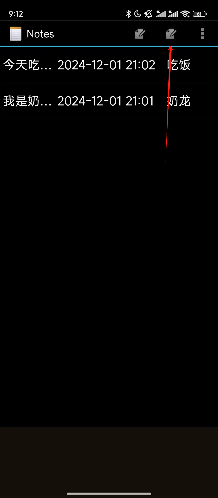
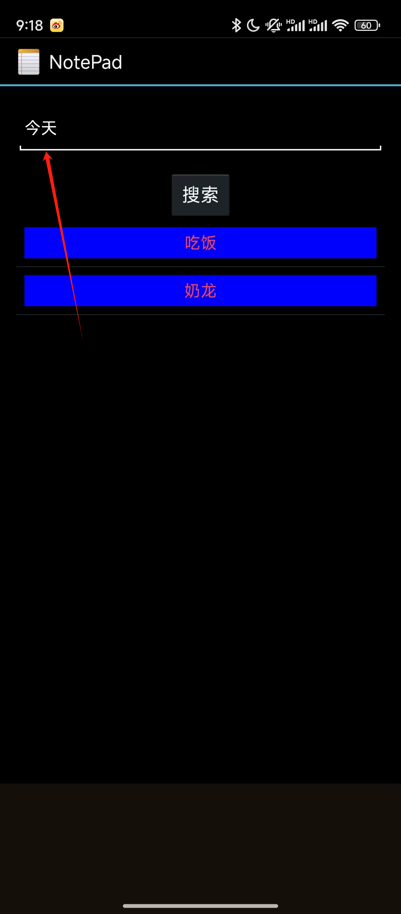
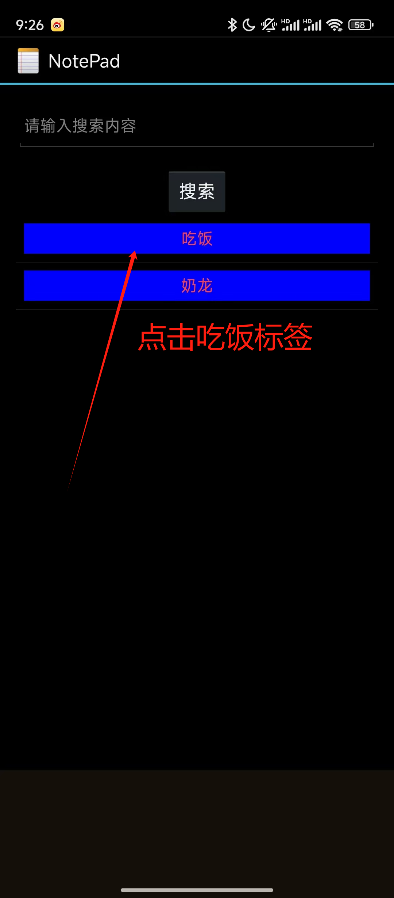

# 安卓期中实验------记事本

**姓名：田金杰**

**学号：121052022126**

## 基本功能

### 一.实现时间戳

#### 1.核心功能代码

```java
`SimpleCursorAdapter adapter`
    `= new SimpleCursorAdapter(`
              `this,                             // The Context for the ListView`
              `R.layout.noteslist_item,          // Points to the XML for a list item`
              `cursor,                           // The cursor to get items from`
              `dataColumns,`
              `viewIDs`
      `);`
`// 设置ViewBinder来处理特定列的数据展示`
`adapter.setViewBinder(new SimpleCursorAdapter.ViewBinder() {`
    `@Override`
    `public boolean setViewValue(View view, Cursor cursor, int columnIndex) {`
        `// 当列索引对应为创建日期列（NotePad.Notes.COLUMN_NAME_CREATE_DATE）时进行处理`
        `if (columnIndex == cursor.getColumnIndex(NotePad.Notes.COLUMN_NAME_CREATE_DATE)) {`
            `// 从游标中获取创建日期的时间戳`
            `long createDateTimestamp = cursor.getLong(columnIndex);`
            `Date date = new Date(createDateTimestamp);`
            `SimpleDateFormat sdf = new SimpleDateFormat("yyyy-MM-dd HH:mm");`
            `// 将日期格式化为指定格式的字符串`
            `String formattedDate = sdf.format(date);`
            `((TextView) view).setText(formattedDate);`
            `return true;`
        `}`
        `return false;`
    `}`
`});`
```

在上述代码中：

1. 首先创建了`SimpleCursorAdapter`用于将数据库游标中的数据绑定到`ListView`的列表项视图上。

2. 然后通过设置ViewBinder

   ，在setViewValue方法中对特定列的数据展示进行自定义处理。当列索引对应为笔记的创建日期列时：

   - 从游标中获取创建日期的时间戳值。
   - 使用`Date`类将时间戳转换为`Date`对象。
   - 再利用`SimpleDateFormat`将`Date`对象格式化为`yyyy-MM-dd HH:mm`格式的字符串。
   - 最后将格式化后的日期字符串设置到对应的`TextView`视图中进行展示。

#### 2.实现截图

详情请看截图1


### 二.搜索功能实现

#### 核心代码实现

##### 1.数据库查询部分

```java
// 设置查询条件，这里是根据NotePad.Notes.COLUMN_NAME_TYPE字段进行筛选
String selection = NotePad.Notes.COLUMN_NAME_TYPE + ">1)" + "GROUP BY (" + NotePad.Notes.COLUMN_NAME_TYPE;
String[] selectionArgs = {};

Cursor cursor = managedQuery(
        NotePad.Notes.CONTENT_URI,
        PROJECTION,
        selection,
        selectionArgs,
        NotePad.Notes.DEFAULT_SORT_ORDER
);
```

在`onCreate`方法中，首先定义了一个查询条件`selection`，这里是基于`NotePad.Notes.COLUMN_NAME_TYPE`字段进行筛选，然后通过`managedQuery`方法，使用定义好的查询条件以及其他相关参数（如`PROJECTION`指定要查询的字段、`NotePad.Notes.DEFAULT_SORT_ORDER`指定排序顺序等）对数据库（`NotePad.Notes.CONTENT_URI`指定的数据源）进行查询操作，查询结果存储在`Cursor`对象中，以便后续用于在`ListView`中展示数据。

##### 2.按钮点击触发搜索并传递参数部分

```java
Button button = (Button) findViewById(R.id.button_search);
button.setOnClickListener(new View.OnClickListener() {
    @Override
    public void onClick(View view) {
        EditText editText = (EditText) findViewById(R.id.editText_search);
        final String message = String.valueOf(editText.getText());

        Intent intent = new Intent(search.this,NotesList.class);
        Bundle bundle = new Bundle();
        bundle.putString("message",message);
        intent.putExtras(bundle);
        startActivity(intent);
    }
});
```

这里获取了`id`为`R.id.button_search`的按钮实例，并为其设置了点击监听器。当按钮被点击时：

1. 首先通过`findViewById`获取`id`为`R.id.editText_search`的`EditText`实例。
2. 然后获取`EditText`中的文本内容，并将其转换为字符串类型存储在`message`变量中。
3. 接着创建一个新的`Intent`，用于启动`NotesList`类对应的活动。
4. 创建一个`Bundle`对象，将获取到的搜索关键词（`message`）放入`Bundle`中。
5. 通过`intent.putExtras`将`Bundle`添加到`Intent`中，以便将搜索关键词传递给`NotesList`类，从而在`NotesList`类中可以根据接收到的关键词进行进一步的查询或数据筛选等操作。

另外，还有一部分是在`ListView`的列表项点击事件处理中，也涉及到将点击项中的文本内容作为参数传递给`NotesList`类，这也可以看作是一种基于用户选择（点击列表项）的搜索相关操作：

```java
ListView listView1= (ListView) findViewById(android.R.id.list);
listView1.setOnItemClickListener(new AdapterView.OnItemClickListener() {
    @Override
    public void onItemClick(AdapterView<?> parent, View view, int position, long id) {
        // 通过position获取被点击项对应的视图（这里假设每一项布局中有一个id为typeitem的TextView用于展示文本）
        TextView textView = (TextView) view.findViewById(R.id.typeitem);
        if (textView!= null) {
            String text = textView.getText().toString();
            // 这里就获取到了被点击项中TextView的文字内容，可以进行后续操作，比如打印或者传递给其他方法等
            Intent intent = new Intent(search.this,NotesList.class);
            Bundle bundle = new Bundle();
            bundle.putString("message",text);
            intent.putExtras(bundle);
            startActivity(intent);
        }
    }
});
```

当`ListView`中的列表项被点击时：

1. 通过`findViewById`从被点击的列表项视图中获取`id`为`R.id.typeitem`的`TextView`实例。
2. 获取`TextView`中的文本内容并存储在`text`变量中。
3. 同样创建一个`Intent`用于启动`NotesList`类对应的活动，将获取到的文本内容作为参数放入`Bundle`中，再通过`intent.putExtras`添加到`Intent`中，最后启动`Intent`将参数传递给`NotesList`类。

#### 实现截图




### 三.分类功能实现

#### 核心代码实现

##### 1.数据库查询及数据展示部分

```java
// 设置查询条件，这里是根据NotePad.Notes.COLUMN_NAME_TYPE字段进行筛选
String selection = NotePad.Notes.COLUMN_NAME_TYPE + ">1)" + "GROUP BY (" + NotePad.Notes.COLUMN_NAME_TYPE;

String[] selectionArgs = {};

Cursor cursor = managedQuery(
        NotePad.Notes.CONTENT_URI,
        PROJECTION,
        selection,
        selectionArgs,
        NotePad.Notes.DEFAULT_SORT_ORDER
);

// 定义要显示的字段数组，这里只显示NotePad.Notes.COLUMN_NAME_TYPE字段，你可根据需求添加其他字段
String[] dataColumns = {NotePad.Notes.COLUMN_NAME_TYPE};
// 对应的布局文件（用于定义ListView的列表项样式）中控件id数组，这里假设布局中显示该字段的TextView的id是R.id.typeitem（如果使用前面创建的新布局文件，就是对应新布局里的id）
int[] viewIDs = {R.id.typeitem};

// 创建SimpleCursorAdapter，将查询到的Cursor数据与ListView的列表项布局进行绑定
SimpleCursorAdapter adapter = new SimpleCursorAdapter(
        this,
        R.layout.list_item_type,  // 如果创建了新布局文件，就替换为新布局的资源ID；如果没创建就使用原布局里的        //  默认样式（不过原布局需确保有对应id的控件）
        cursor,
        dataColumns,
        viewIDs
);

// 将适配器设置给ListView，这样ListView就能显示查询到的数据了
listView.setAdapter(adapter);
```


- 查询条件设置
  - 通过`String selection = NotePad.Notes.COLUMN_NAME_TYPE + ">1)" + "GROUP BY (" + NotePad.Notes.COLUMN_NAME_TYPE;`这行代码设置了数据库查询的条件。这里是基于`NotePad.Notes.COLUMN_NAME_TYPE`字段进行筛选，但从代码来看这个查询条件的表达式可能存在问题（如前面提到的`>1)`这种写法不太准确，可能是想表达类似`> '1'`这样完整的比较表达式，具体要根据`COLUMN_NAME_TYPE`字段的数据类型来确定正确写法）。假设这里是想按照某种分类标准（比如按照类型值大于某个特定值来进行分类筛选）来查询数据。
  - 然后使用`managedQuery`方法根据设置好的查询条件（`selection`）、要返回的字段数组（`PROJECTION`）、空的查询参数数组（`selectionArgs`）以及默认的排序顺序（`NotePad.Notes.DEFAULT_SORT_ORDER`）对数据库（`NotePad.Notes.CONTENT_URI`指定的数据源）进行查询操作，查询结果存储在`Cursor`对象中。
- 数据展示设置
  - 定义了要展示的字段数组`String[] dataColumns = {NotePad.Notes.COLUMN_NAME_TYPE};`，这里只指定了展示`NotePad.Notes.COLUMN_NAME_TYPE`字段，意味着在`ListView`的列表项中主要展示的是笔记的类型信息，通过这种方式可以将不同类型的笔记进行区分展示，实现初步的分类展示效果。
  - 接着创建了`SimpleCursorAdapter`，将查询到的`Cursor`数据与`ListView`的列表项布局进行绑定。通过指定布局文件（`R.layout.list_item_type`）中控件的`id`数组（`int[] viewIDs = {R.id.typeitem};`），使得从数据库查询到的`COLUMN_NAME_TYPE`字段的值能够正确显示在对应的`TextView`（`id`为`R.id.typeitem`）上，从而在`ListView`中呈现出按照类型分类展示的笔记列表。

##### 2.数据传递及后续处理部分

```java
ListView listView1= (ListView) findViewById(android.R.id.list);
listView1.setOnItemClickListener(new AdapterView.OnItemClickListener() {
    @Override
    public void onItemClick(AdapterView<?> parent, View view, int position, long id) {
        // 通过position获取被点击项对应的视图（这里假设每一项布局中有一个id为typeitem的TextView用于展示文本）
        TextView textView = (TextView) view.findViewById(R.id.typeitem);
        if (textView!= null) {
            String text = textView.getText().toString();
            // 这里就获取到了被点击项中TextView的文字内容，可以进行后续操作，比如打印或者传递给其他方法等
            Intent intent = new Intent(search.this,NotesList.class);
            Bundle bundle = new Bundle();
            bundle.putString("message",text);
            intent.putExtras(bundle);
            startActivity(intent);
        }
    }
});
```

当用户点击`ListView`中的列表项时：

- 通过`findViewById`从被点击的列表项视图中获取`id`为`R.id.typeitem`的`TextView`实例，这个`TextView`展示的就是前面按照分类查询并展示出来的笔记类型信息。
- 获取`TextView`中的文本内容并存储在`text`变量中，然后将这个文本内容作为参数（通过`Bundle`）传递给`NotesList`类。在`NotesList`类中应该可以根据接收到的这个类型信息进一步进行相关操作，比如根据类型再次进行筛选、分类展示等。

#### 实现截图：



## 总结：

### （一）总结

本次实验在 Android 笔记应用的搜索与分类功能实现上取得了一定的进展，初步构建了`search`类的基本框架，包括界面布局、数据库查询、数据展示以及部分交互功能。然而，在功能的完整性、代码质量和健壮性方面仍存在一些问题需要解决，以实现一个可靠、易用的搜索与分类功能模块。

### （二）改进建议

1. **修正数据库查询条件**：根据`COLUMN_NAME_TYPE`字段的实际数据类型，修正查询条件中的比较表达式，确保能够准确地按照笔记类型进行分类筛选数据。
2. **完善`NotesList`类中的处理逻辑**：在`NotesList`类中添加对从`search`类传递过来的参数（无论是列表项点击传递的类型信息还是按钮点击传递的`EditText`内容）的完整处理逻辑，实现真正意义上的搜索和分类功能联动，例如根据类型信息进行二次筛选展示、根据搜索关键词在笔记标题、内容或类型中进行模糊查询等。
3. **增强代码健壮性**：添加对边界情况的处理代码，如当`EditText`为空时给出提示信息，当数据库查询结果为空时在界面上展示友好的提示，避免应用出现空指针异常或界面显示异常等情况。同时，可以考虑添加日志记录功能，以便在应用运行过程中出现问题时能够快速定位和排查错误。
4. **优化代码结构与设计**：进一步优化代码结构，例如将数据库查询、数据适配等操作封装成独立的方法，提高代码的可读性和可维护性。同时，可以考虑采用更合理的设计模式，如 MVP（Model-View-Presenter）或 MVVM（Model-View-ViewModel）模式，将数据逻辑、视图展示和用户交互进行更清晰的分离，便于后续的功能扩展和代码维护。
